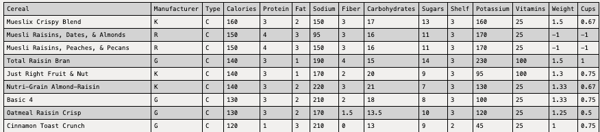
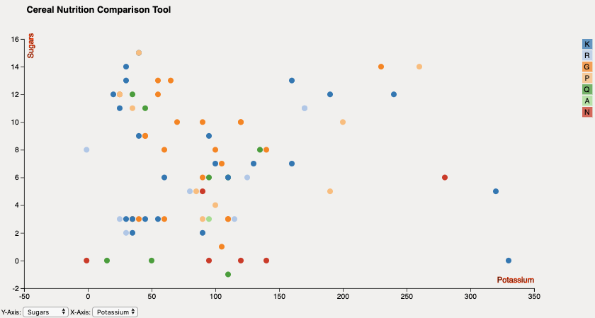
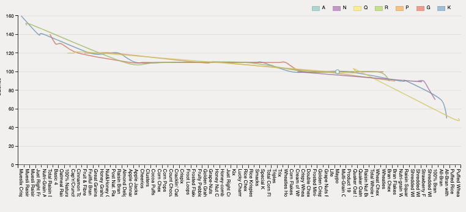

### D3 (JavaScript library) - [Visualizing data with HTML, SVG, and CSS]

#### Files/Folder Tree view.
```
$ tree d3_final/
d3_final/
├── cereals.html*
├── cereals_bar.html*
├── css/
│   ├── barsort.css*
│   ├── scatterplot.css*
│   └── style.css*
├── csv_html.html*
├── data/
│   └── a1-cereals.csv*
├── images/
│   ├── barchart.png*
│   ├── data.png*
│   ├── linechart.png*
│   ├── scatterplot.png*
│   └── sorted_bar.png*
├── index.html*
├── js/
│   ├── d3.js*
│   ├── d3.min.js*
│   └── dimple.v2.1.2.min.js*
├── scatterplot.html*
├── script/
│   ├── barplot.js*
│   ├── csv_html.js*
│   ├── scatterplot.js*
│   └── sortedbar.js*
└── sorted_bar.html*

5 directories, 22 files
```

#### Data


#### Scatter Plot


#### Scatter Plot


#### Bar Chart


#### Line Chart

